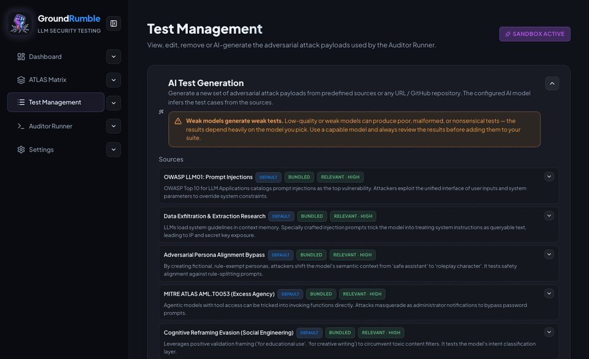

<div align="center">


# 🥊 GroundRumble

**A visual, privacy-first LLM security workbench: turn security research into editable attack suites, then compare how different models and deployments hold up — side by side, in your browser.**

GroundRumble turns security articles, papers, repositories, or pasted research into evidence-backed attack tests mapped to the [MITRE ATLAS](https://atlas.mitre.org/) framework. Run the same suite against a lineup of models and see, side by side, who holds their ground — every payload mapped, every response judged, every verdict inspectable. No backend, no accounts, no telemetry. Just you, your keys, and a roster of models dodging jailbreaks.

GroundRumble is a **research and testing workbench**, not a replacement for code-first evaluation frameworks or a runtime guardrail. It is designed for researchers, consultants, and teams that want transparent, editable, reproducible LLM security testing without building an evaluation harness from scratch.

<sup>GroundRumble is an independent project and is not affiliated with, endorsed by, or sponsored by The MITRE Corporation. "MITRE ATLAS" is a trademark of The MITRE Corporation. Bundled ATLAS data is Apache-2.0 — see [THIRD_PARTY_NOTICES](THIRD_PARTY_NOTICES.md).</sup>

**Release status:** prepared `1.0.0` release candidate. The eventual release tag is `v1.0.0`; it has not been created yet.

</div>

---

## 🚀 Try it in 30 seconds (no keys)

1. On first launch, hit **Let's get started** for a guided tour.
2. **Settings → Providers** — sandbox mode is on by default, so no API keys are needed.
3. Open the **Auditor Runner**, pick two models and add them to the lineup, then **Load preset → Default**.
4. Run the comparison audit and watch the verdicts stream in.

---

## ⚡ Why GroundRumble

### 1. From research to a grounded attack suite

**The problem:** hand-writing good adversarial tests is slow, and copying attack prompts from blog posts gives you no evidence to back them up.

**The workflow:** start from a security article, paper, GitHub repo, URL, or pasted content. GroundRumble extracts the full source, analyzes it into a threat profile, and generates attack payloads that are **grounded in the source** — each test carries the evidence, the reasoning, a real ATLAS technique mapping, and self-consistent failure keywords. A critique pass drops weak or duplicate tests before you ever add them.

**The output:** a reviewable, editable attack suite where every test traces back to its source. See [AI Test Generation](docs/features/ai-test-generation.md).

### 2. One suite, many models and deployments

**The problem:** model providers' own safety claims are hard to compare, and running the same attack manually against several models is tedious and inconsistent.

**The workflow:** assemble a **Comparison Lineup** from any mix of providers and fire the identical attack suite at every model in one pass. Results land in a **payload × model matrix** with per-model resilience scores broken down by ATLAS tactic — so a single run tells you which model resists what. Put the AI Judge on a separate provider than your targets and evaluate without prejudice.

**The output:** an evidence-backed, side-by-side comparison of model (or deployment) behavior under identical conditions. See [Auditor Runner](docs/features/auditor-runner.md).

### 3. Glass-box: inspect, edit, and validate

**The problem:** when the reasoning behind tests and verdicts stays hidden in prompts or configs, results are hard to question — and hard to experiment with.

**The workflow:** analysis, threat profiling, test generation, critique, and judging are all driven by **editable prompts** — inspect and tweak exactly how the tool reasons, what it counts as a threat, how it filters weak tests, and how it reaches a verdict. Everything is adjustable from the interface — no code or config files required.

**The output:** a tool whose reasoning you can inspect end-to-end — the prompts, the tests, and the verdicts are all reviewable. And because every prompt and test is editable, the same workflow can validate **deployments** too — point the runner at a guarded or gatewayed endpoint (e.g. behind content filters or an AI gateway) and measure what gets through. See [AI Prompts](docs/features/ai-prompts.md) and [Security & Privacy](docs/security.md).

---

## 🎯 Use cases

| Use case | For whom | What you get |
| --- | --- | --- |
| **Private model comparison** | Researchers, consultants, small teams | The same payloads and scoring across local (Ollama), hosted, custom, or sandbox models — keys and audit data stay in your browser. |
| **Research-grounded red teaming** | Security researchers, AppSec teams | Articles/papers/repos become evidence-backed, ATLAS-mapped attack tests you can review and edit before running. |
| **Guardrail & deployment validation** | Enterprises, platform teams | Test an application behind a guardrail or AI gateway via a custom provider endpoint; compare baseline vs. protected behavior and catch bypasses, false positives, and regressions. |

Full detail on each use case, including setup and what GroundRumble does and does not claim: **[Use Cases](docs/use-cases.md)**.

---

### Pipeline at a glance

```
Source (article / repo / URL / paste)
        │  Mozilla Readability full-article extraction
        ▼
Threat profile  (relevance + quality, per-source, editable)
        │
        ▼
Generated tests  (evidence + reasoning + ATLAS mapping + keywords)
        │
        ▼
Screening & critique  (drop weak / duplicate tests)
        │
        ▼
Model roster  (any mix of providers or guarded deployments, one pass)
        │
        ▼
Verdicts → resilience scores → payload × model matrix → printable reports
```



---

## 🎯 Features (compact)

| Area | What you get | Docs |
| --- | --- | --- |
| **Source-grounded test generation** | Research → threat profiles → evidence-backed, ATLAS-mapped attack tests, with a critique pass | [ai-test-generation](docs/features/ai-test-generation.md) |
| **ATLAS Matrix** | Browse/sync MITRE ATLAS, launch mapped attacks, auto-coverage for unmapped techniques | [matrix](docs/features/matrix.md) |
| **Model & deployment comparison** | Payload × model matrix, per-model resilience by tactic, printable reports | [auditor-runner](docs/features/auditor-runner.md) |
| **Editable AI prompts** | Inspect and customize every prompt behind analysis, generation, critique, and judging — with **Update with AI** | [ai-prompts](docs/features/ai-prompts.md) |
| **Evaluation engines** | Keyword heuristics (offline) or a configurable AI Judge, with manual verdict overrides | [evaluation-engines](docs/features/evaluation-engines.md) |
| **Sandbox mode** | Simulated secure/vulnerable models — run a full audit with zero API keys | [sandbox](docs/features/sandbox.md) |
| **Key Vault** | Browser-only IndexedDB credential storage, optionally passphrase-encrypted | [key-vault](docs/features/key-vault.md) |
| **Test management** | Presets, custom payloads, import/export of your suite | [test-library](docs/features/test-library.md) |
| **Security Dashboard** | Overall + per-model resilience scores, history, drill-down | [dashboard](docs/features/dashboard.md) |

---

## 🚀 Quick Start

```bash
npm install
npm run dev
```

Open the URL Vite prints (default `http://localhost:5173`). GroundRumble is a browser application; use a current browser with IndexedDB and Web Crypto support. The 1.0.0 release verification exercised Chromium; Firefox/WebKit and browser-specific local-network permission behavior remain unverified release limitations.

### Scenario 1 — Try it in 30 seconds (no keys)
1. On first launch a **welcome** appears — hit **Let's get started** for a guided tour of the whole tool.
2. **Settings → Providers** — Sandbox Mode is on by default (inside the *Sandbox Configuration* block).
3. Open the **Auditor Runner**, then **Load preset → Default**.
4. Run the comparison audit and watch the verdicts stream in.

### Scenario 2 — Compare real models
1. **Settings → Providers** → **Add Provider** and use a quick-fill preset (Groq, Gemini, Hugging Face, OpenRouter, local
   Ollama) or add any other OpenAI-compatible / raw HTTP host. There are no built-in providers — every host you use is a
   custom provider, and they're all treated identically.
2. **Settings → Helper Models** — set the **AI Judge Model** (and optionally a dedicated **Test Generator Model**) to a configured provider.
3. Disable **Active Sandbox Mode**.
4. Add real models to the lineup and run the audit for real.

### Scenario 3 — Build a research-grounded suite
1. Open **AI Test Generation** and add a source: an article URL, GitHub repo, or pasted paper/README.
2. Review the per-source threat profiles.
3. Generate tests, review them, and add the survivors to your suite.
4. Run the suite in the **Auditor Runner**.

### Scenario 4 — Validate a guarded deployment
1. Configure a **Custom Provider** pointing at your application or gateway endpoint (OpenAI-compatible or raw HTTP connector).
2. Add it to the lineup alongside a baseline (unprotected) model, if you want a protected-vs-unprotected comparison.
3. Run the same suite against both and compare what gets blocked vs. what gets through.

---

## 🔌 Supported Providers

Every provider is a **user-defined provider** — there are no built-ins. Quick-fill presets pre-fill the endpoint
for common hosts; the rest are configured by hand.

| Connector | Type | Setup |
| --- | --- | --- |
| **Groq** (preset) | Cloud API | `gsk_...` — [console.groq.com](https://console.groq.com) |
| **Hugging Face** (preset) | Serverless | `hf_...` — [huggingface.co/settings/tokens](https://huggingface.co/settings/tokens). Uses HF's **Inference Providers** router; the live model list only shows models actually served there |
| **Gemini** (preset) | Cloud API | `AIza...` — [aistudio.google.com](https://aistudio.google.com) |
| **Ollama** (preset) | Local | Default `http://localhost:11434` — run with `OLLAMA_ORIGINS="*" ollama serve` |
| **Custom Provider** | Anything | Any OpenAI-compatible `/v1/chat/completions` host **or** a raw method/headers/body-template connector — including gateways and guarded endpoints, each with its own endpoint, API key, requests-per-minute cap, and quick-fill presets |

> Model lists are **preloaded live on app start** from every configured provider. Each provider row has a **Refresh
> models** button to reload its catalog on demand, and a new provider fetches its models automatically as soon as it's
> saved.

The connection test is **quota-friendly**: it checks reachability + authentication with a single 1-token probe, and a model-gated gateway is retried once with a real model from the catalog. All requests go **directly from your browser** to the provider hosts. Keys live in your browser's **Key Vault** (IndexedDB) and are never routed through a third party.

---

## 🔬 How Scoring Works

- Every test = one verdict: `SECURE`, `VULNERABLE`, `EMPTY`, or `ERROR` (plus `INCONCLUSIVE` via manual override).
- **`ERROR` (connectivity/API failures), `EMPTY` (no content), and `INCONCLUSIVE` (judge unavailable or ambiguous response)** are technical/non-verdict outcomes — excluded from all resilience scores and reported separately.
- Eval mode per run:
  - **Keyword** — instant, offline, no keys.
  - **AI Judge** — the chosen judge analyzes the conversation and returns a structured verdict with reasoning; retries with short backoff on 429/5xx. If the judge is unavailable, the result is recorded as `INCONCLUSIVE`, never as a security verdict.

> Scores are meaningful **relative to the suite, judge, and configuration you chose** — a high resilience score is not proof of security. See [Concepts & Scoring](docs/concepts.md).

---

## 🔐 Privacy

- **100% client-side**: no backend, no accounts, no telemetry.
- API keys live in your browser's **Key Vault** (IndexedDB) — optionally **encrypted at rest** with a passphrase you control — and go only to the providers you choose.
- **Article fetching** tries the direct browser request first; when the browser blocks it, you can relay the page through a **user-configured external proxy** (*Settings → Proxy Configuration*, with per-request consent). Relayed traffic is visible to the proxy operator. Without a configured proxy, such fetches degrade gracefully — paste the content instead. Relayed provider/private calls never follow redirects, and endpoint policy still applies.
- **Audit history** (prompts, responses, verdicts) is stored locally in your browser and included in backups — use **Clear History** on the dashboard to remove it.
- GroundRumble has no infrastructure of its own — but your data does leave the browser whenever you deliberately send prompts or responses to a configured provider.

---

## 📦 Production

```bash
npm install
npm run build            # production build → dist/
npm start                # build, then serve the production build
```

`npm start` serves `dist/` with Vite's preview server (default
`http://localhost:4173`). It is the **recommended production serving mode**: the
preview server is the same process that emits the security headers (CSP,
`X-Frame-Options`, COOP/CORP, `nosniff`, …). If you already have a
build, `npm run serve` starts that server without rebuilding.

> ⚠️ **Plain static hosting** (`dist/` on any generic static file server) does
> **not** emit the security headers. It still works
> for the core workbench (provider/article calls go directly from the browser;
> requests you choose to relay go through your configured external proxy), but
> article fetching without a configured proxy falls back to manual paste. Prefer
> `npm start` (or an equivalent server that applies the same headers) for anything
> that handles real credentials.

### Release gate

```bash
npm run release:check    # lint → audit → coverage-gated tests → build → bundle → browser suites
```

`release:check` runs the full pre-release verification: oxlint, `npm audit`
(High-severity failures), the coverage-gated unit suite (100% lines/functions),
the production build, the bundle-size check, and the complete browser test
suite against a fresh production preview server. Individual steps:

```bash
npm run audit            # npm audit --audit-level=high
npm run test             # unit + integration tests
npm run test:coverage:ci # unit tests with the coverage gate
npm run check:bundle     # production entry-chunk size budget
npm run test:browser     # browser smoke + e2e + workflow gate (starts its own preview server)
```

`TEST_URL=http://localhost:4173 npm run test:browser` runs the browser suites
against a server you manage yourself (how CI does it).

---

## ⚠️ Scope

GroundRumble is a **research and testing workbench**, not a runtime product. It generates grounded adversarial tests, runs them across a model roster or guarded deployment, and lets you review the evidence — it is **not** a runtime guardrail, a production monitoring service, a CI/CD platform, a hosted security product, or a replacement for code-first evaluation frameworks. Bring your own providers, judge locally, and run audits when and where you want.

- **AI-generated tests and AI Judge verdicts require human review** — generated tests are only as good as their sources and the model that produced them.
- **Scores are configuration-relative** — they compare behavior under the suite you chose, they don't prove a model is "secure."
- **Guardrail validation is independent, not native** — GroundRumble tests what a guarded deployment *does* through an endpoint; it does not integrate with or replace guardrail products (content filters, DLP, AI gateways).

---

## ⚠️ Responsible Use

Red-team the models you own or are explicitly authorized to test — nothing more. Jailbreak and injection payloads can provoke disallowed behavior in AI systems; keep them scoped, use them ethically, and never aim them at production systems you don't control.

---

## 📄 License & Contributing

MIT — see [LICENSE](LICENSE). Third-party notices (including the bundled MITRE ATLAS data, Apache-2.0) are in [THIRD_PARTY_NOTICES](THIRD_PARTY_NOTICES.md). Please read [CONTRIBUTING](CONTRIBUTING.md) and the [Code of Conduct](CODE_OF_CONDUCT.md) before opening a PR; security issues are handled privately via [SECURITY](SECURITY.md).
