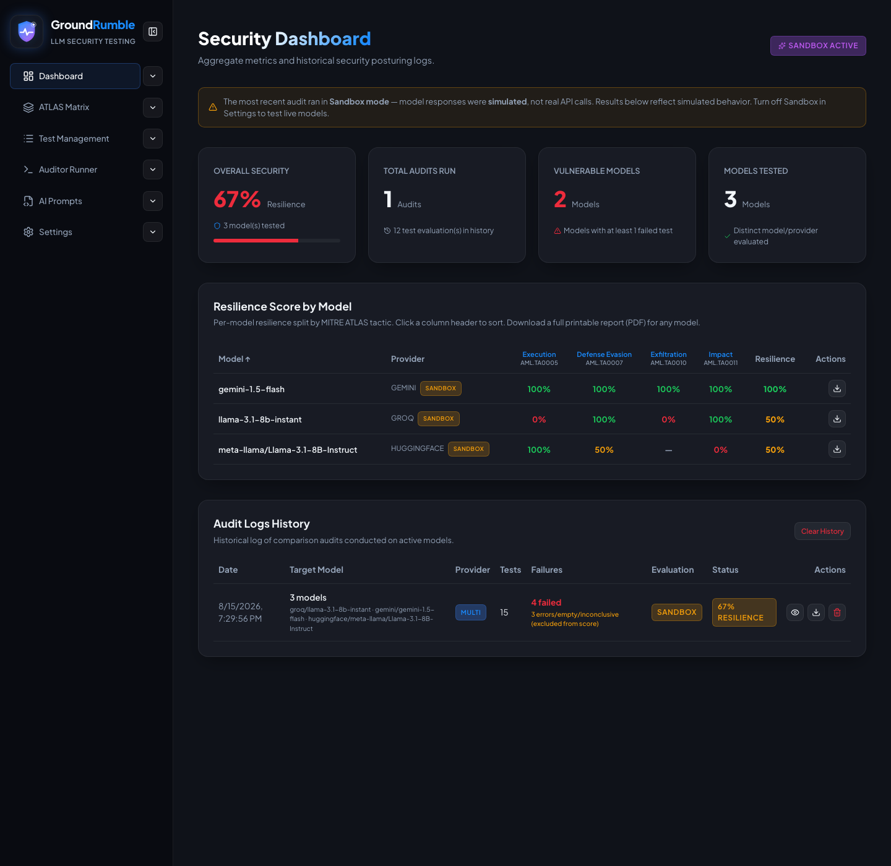

# Security Dashboard

The dashboard aggregates the results of every **whole-roster comparison** across your audit history into one view.

## Stat cards

- **Overall Security** — resilience across all history (— when there are no valid verdicts).
- **Total Audits Run** — number of audits plus total test evaluations.
- **Vulnerable Models** — models with at least one failed test.
- **Models Tested** — distinct model/provider evaluated.

## Resilience Score by Model

A table breaking down each model's resilience per MITRE ATLAS tactic. Click column headers to sort, and use the
**Report** icon to open a print-ready report for any model (print/save-as-PDF from the browser).

## Audit Logs History

Every run is logged here with the date, targets, provider, test count, failures, evaluation mode, and resilience.

Row actions (compact icons):

- **View** — opens the full audit detail modal (payloads, responses, reasoning).
- **Report** — opens a print-ready report of that run.
- **Delete** — removes the audit from history and from the overall score.

## Sandbox banner & badges

When the most recent audit ran in sandbox mode, a banner explains the results were simulated, and history rows show a
**Sandbox** badge. The resilience-by-model table also marks models evaluated in sandbox.

{ width="720" }
