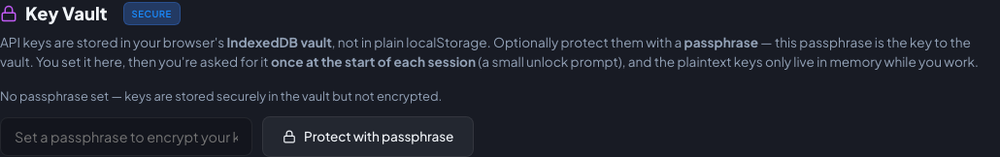

# Key Vault

Secure, browser-only storage for your API keys and providers.

## Why a vault

API secrets are stored in **IndexedDB** (not plain `localStorage`), so they don't sit in easily readable storage keys.
You can optionally **encrypt them at rest** with a passphrase (PBKDF2 + AES-256-GCM).

## How it works

- **No passphrase (not recommended)** — keys are stored in the vault (IndexedDB) but not encrypted. Anyone with browser profile/storage access can read them. Set a passphrase before adding production credentials.
- **With a passphrase** — the stored vault is an AES-256-GCM envelope; the plaintext keys exist **only in memory** for
  the current session. On each new session you're asked for the passphrase **once**.
- **Lock** — drops the plaintext keys from memory and re-gates the app behind the passphrase.

The vault is not a password manager: a passphrase protects the vault at rest, but an unlocked page can still be read by scripts running on that origin. Use a trusted origin and keep the vault locked when it is not in use.

## Read-only mode

If you skip unlocking, the app enters **read-only mode**:

- **Settings** and the **Auditor Runner** are disabled.
- AI-powered actions (test generation, judge testing, source assessment) are turned off.
- Dashboard, matrix, test library, presets, and history remain browsable.
- Audit history is shown **summary-only** while locked: verdict counts, scores, and model/provider labels are visible,
  but prompts, model responses, evaluation reasoning, detailed result panels, and printable reports are hidden until you
  unlock your keys.
- A persistent banner offers **Unlock keys** at any time.

!!! danger "Forgot your passphrase?"
    The keys are encrypted only with your passphrase and **cannot be recovered**. Your only option is to **Reset the
    platform**, which deletes everything and starts fresh.

## Unsupported context

If the browser doesn't expose Web Crypto/IndexedDB in a secure context (e.g., plain-HTTP LAN access), the Key Vault
**cannot persist secrets** and the app runs without stored credentials. There is no localStorage fallback — load
GroundRumble over HTTPS or localhost to enable encrypted key storage. The Key Vault card shows an `UNSUPPORTED` badge
in this case.

## Where to manage it

**Settings → Account & Data → Key Vault**: set/change/remove the passphrase, lock, and unlock. The locked state is also
surfaced on the **Providers** card (inputs disabled and a clear notice).

{ width="720" }
