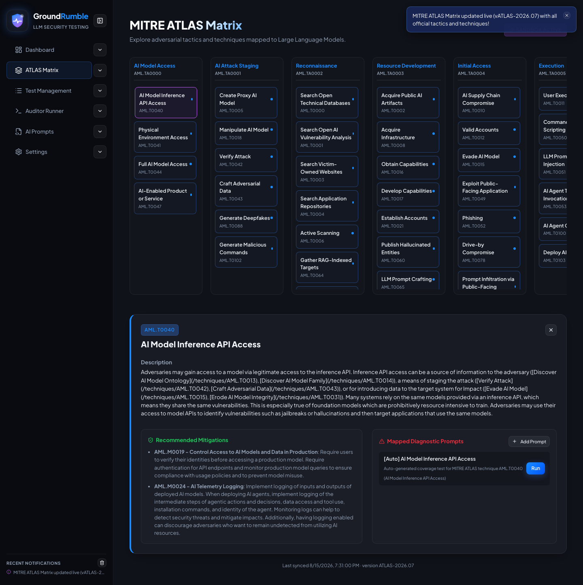

# ATLAS Matrix

The interactive [MITRE ATLAS](https://atlas.mitre.org/) tactic/technique browser — the **ATLAS-native backbone** every
test payload maps to, whether curated, auto-generated, or source-grounded from research.

## Syncing the matrix

The matrix ships **preloaded** with the latest MITRE ATLAS bundle and **auto-syncs on app load**. You can also force a
sync manually from **Settings → MITRE ATLAS Framework Database** — click **Sync Live ATLAS** to download the official
framework from `mitre-atlas/atlas-data`. The status below the button shows the sync result (last-synced time + version).
If a sync fails, the app keeps showing the cached matrix and notes that it's the cached version.

## Exploring

- Click any **technique card** to open a detail panel below it.
- The detail panel shows the **description**, **Recommended Mitigations**, and **Mapped Diagnostic Prompts** — the
  ready-to-run attack payloads that test that technique.
- From the detail panel you can **Run** a mapped prompt (jumps to the Auditor Runner with that test selected) or **Add
  Prompt** to create a new payload for the technique.
- Techniques with mapped tests are highlighted with a blue dot.

{ width="720" }

## Auto-generated coverage

After a sync, every technique that lacks a curated payload gets an auto-generated coverage test, added to the suite and
pre-selected automatically.
