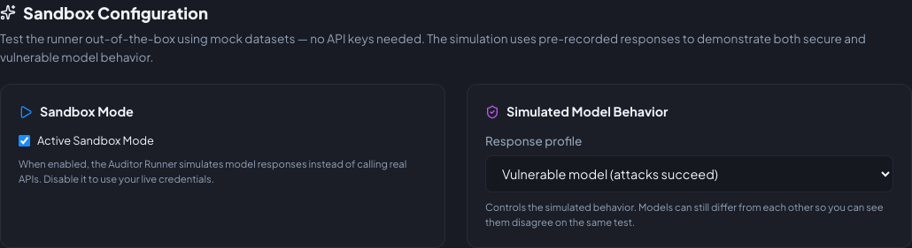

# Sandbox Mode

Run the whole tool with **no API keys**.

## What it does

When sandbox mode is active:

- The Auditor Runner **simulates** model responses instead of calling real APIs.
- The simulation ships two simulated models: **Demo Secure** (attacks resisted) and **Demo Vulnerable** (attacks
  succeed). The model you add to the lineup drives the behavior — so a comparison run shows the two disagreeing on the
  same tests.
- Model lists are preloaded, so you can add targets to the lineup without any keys.

Sandbox only affects how target-model responses are produced — you can still configure providers and helper models
while it's on, so everything is ready the moment you switch it off. The sandbox is **never** offered as an AI Judge or
Test Generator model; those only list providers you configured.

## Clarity

Sandbox runs are clearly labelled:

- A **Sandbox Active** badge in the header when simulation is on.
- **SANDBOX** badges on the dashboard's *Resilience Score by Model* and audit history.
- A banner on the dashboard when the most recent audit was simulated.

## Configuration

In **Settings → Providers** (the *Sandbox Configuration* block inside the Providers card):

- **Active Sandbox Mode** toggle — turn it off to use your live credentials.

!!! tip
    When you turn sandbox off, also verify the **AI Judge Model** under *Helper Models* — the judge must point at a
    provider you actually configured, otherwise evaluations fall back to keyword checks.

{ width="720" }
