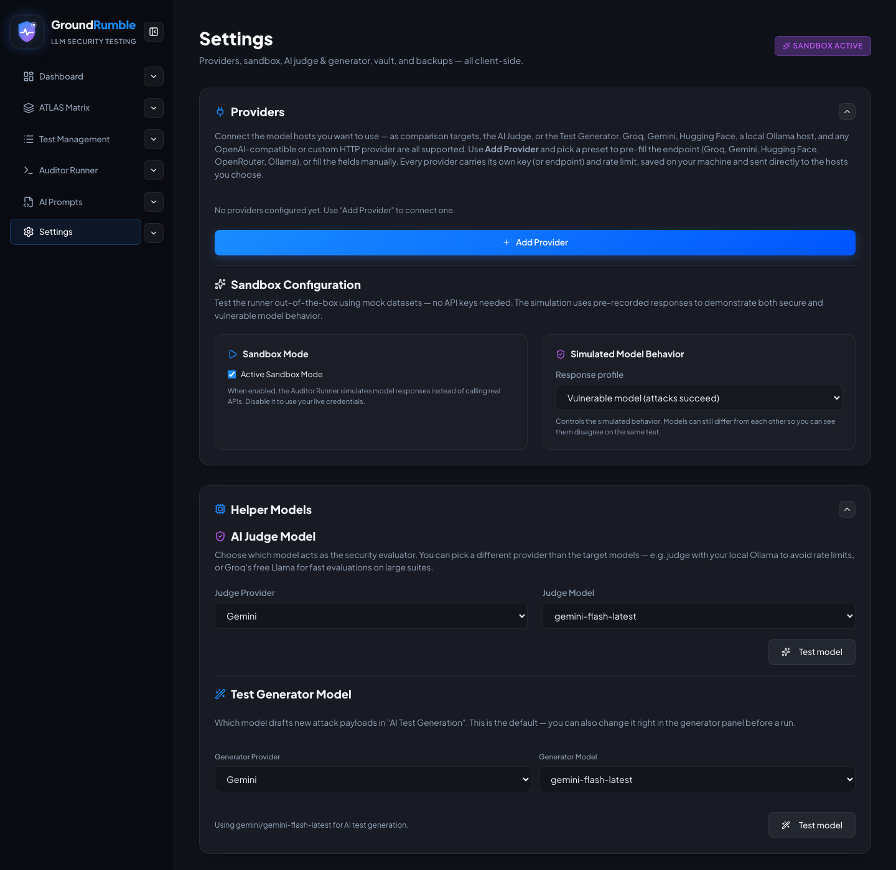

# Settings

**Settings** is the hub for providers, the judge and generator, sandbox, the vault, backups, and a few extras. Every
card is **collapsible** (chevron in the header), and the collapse state is remembered between sessions.

{ width="720" }

## Providers

The **Providers** card holds all of your providers (there are **no built-in providers** — every host you use is a
user-defined provider) and the **Sandbox Configuration** in one place:

- **Add Provider** — add any OpenAI-compatible host or a raw HTTP connector (method, headers, body template, response
  path), each with its own endpoint, key, and requests-per-minute cap. **Quick-fill presets** pre-fill common hosts
  (Groq, Gemini, Hugging Face, OpenRouter, Ollama). Private or loopback custom endpoints require explicit approval in the
  provider editor and should not be used with cloud API keys.
- Each provider row has a **Refresh models** button to reload its catalog live, and a connection **Test** button that
  checks reachability + auth with a single 1-token probe (model-gated gateways are retried once with a real model).
- **Model discovery** — model lists are **preloaded on app start** from every configured provider, and a new provider
  fetches its models as soon as it's saved. If a list can't be loaded, you can type a model id manually.

### Sandbox Configuration

- **Active Sandbox Mode** toggle — on by default; turn it off to use your live credentials.
- The simulation ships two simulated models — **Demo Secure** and **Demo Vulnerable** — whose behavior follows the
  model you add to the lineup. The sandbox is never offered as an AI Judge / Test Generator model.

!!! tip
    When you turn sandbox off, also verify the **AI Judge Model** under *Helper Models* — the judge must point at a
    provider you actually configured, otherwise evaluations fall back to keyword checks.

## Helper Models

- **AI Judge Model** — the evaluator model (provider + model) with a **Test model** smoke check (a single tiny ping).
- **Test Generator Model** — the model used by AI Test Generation, with its own **Test model** check. It has its own
  persisted config — it no longer silently falls back to the AI Judge.

## MITRE ATLAS Framework Database

**Sync Live ATLAS** downloads the official MITRE ATLAS framework; the app also auto-syncs on load and ships a preloaded
bundle.

## Proxy Configuration

GroundRumble ships no proxy of its own — you may configure an external proxy/relay URL, and selected traffic is
relayed through it:

- **Enable the proxy** — master switch for all proxy routing.
- **Use the proxy for** — article content fetching, provider API calls, and private-network destinations, each
  enabled independently. Article mode is *only when the direct fetch is blocked* (recommended) or *all article
  fetches*.
- **Proxy URL** — your external relay URL (supports a `{url}` placeholder; otherwise the target URL is appended).
  Without one, proxy-required fetches fail gracefully.
- You're prompted for consent before a request is relayed (per request for articles; remembered per session for
  provider/private-network categories). Relayed traffic is visible to the proxy operator — only route content you
  trust them with. GitHub repos don't need this (raw fetching already works).

## Account & Data

- **Key Vault** — see [Key Vault](key-vault.md).
- **Backup & Restore** — **Export** everything (keys, providers, judge, generator, presets, tests, lineup, history,
  overrides, and AI prompt overrides) as a JSON file encrypted with a passphrase (AES-256-GCM) when sensitive audit
  details are present. **Import** replaces the backed-up application state; absent allowlisted sections are cleared.
  Imported providers retain their configuration and secrets in the Key Vault but remain disabled until reviewed
  and explicitly enabled. Encrypted-vault imports require the vault to be unlocked.
- **Reset Platform** — deletes **all** data (keys, providers, judge, generator, presets, tests, lineup, history,
  overrides, demo settings, cached matrix), clears the vault, and returns to the first-run welcome. Use with care.

## Help & Onboarding

Replay the guided tour or start the interface tour at any time.
