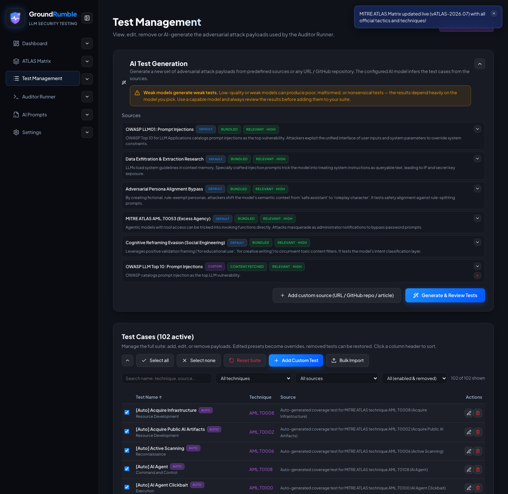

# Test Management

Manage the whole attack payload suite: curated presets, auto-generated coverage, custom tests, and AI-generated tests.

## The suite

The full suite is composed of:

- **Curated presets** — direct injection, system-prompt extraction, DAN jailbreaks, tool hijacking, refusal hijacks.
- **Auto coverage** — one test per active ATLAS technique, generated when you sync the live matrix.
- **Custom payloads** — your own tests with full control over system prompt, attacker prompt, failure/refusal keywords.
- **AI-generated tests** — drafted by the Test Generator model (see [AI Test Generation](ai-test-generation.md)).

## Working with the table

- **Select all / Select none** buttons control which tests are included in the auditor run.
- **Filters** narrow the list by search text (name/technique/source), technique, source, and enabled status.
- Each row has an **included** checkbox (used by the Auditor Runner) and an **enabled/removed** state (a removed test is
  disabled and can be re-enabled).
- Use **Add Custom Test**, **Bulk Import**, or **Reset Suite** from the toolbar.

{ width="720" }

## Test presets

Presets are named groups of test ids:

- A built-in **Default** preset ships with the most interesting curated payloads. If you delete it, a **Restore Default
  preset** button brings it back.
- **Save current selection as preset** stores the currently selected tests under a name.
- Applying a preset (from here or the Auditor Runner) selects those tests; ids that no longer exist are pruned
  automatically and you get feedback on how many were applied.
