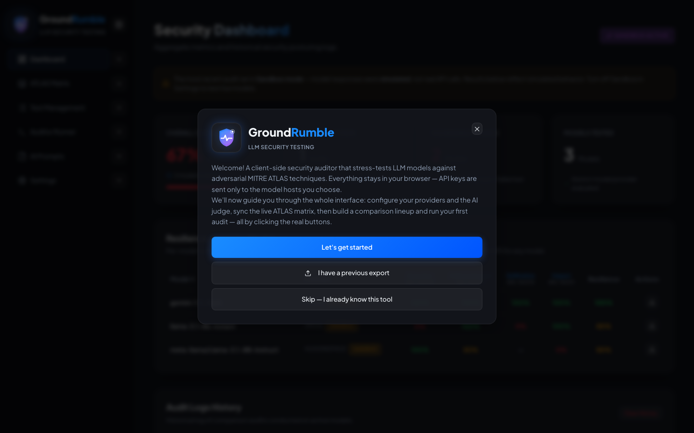

# Quick Start

GroundRumble is browser-native — no install, no backend, no accounts. Get a first audit running in seconds.

## Install & run

```bash
npm install
npm run dev
```

Open the URL Vite prints (default `http://localhost:5173`).

---

## Scenario 1 — Try it in 30 seconds (no keys)

1. On first launch a **welcome** appears — hit **Let's get started** for a guided tour of the whole tool.
2. **Settings → Providers** — sandbox mode is on by default (in the *Sandbox Configuration* block), so no keys are needed.
3. Open the **Auditor Runner**, pick two models — **Demo Secure** and **Demo Vulnerable** — and add them to the lineup, then **Load preset → Default**.
4. Click **Run Comparison Audit** and watch the verdicts stream in.

{ width="560" }

!!! tip
    In sandbox mode the runner simulates model responses. The **Demo Secure** model resists attacks and the **Demo
    Vulnerable** model complies with them — add both to the lineup to see the same test produce opposite outcomes. This
    is the fastest way to understand what a comparison run tells you — without spending a cent.

## Scenario 2 — Compare real models

1. **Settings → Providers** — **Add Provider** and pick a quick-fill preset (Groq, Hugging Face, Gemini, OpenRouter,
   local Ollama) or add any other OpenAI-compatible / raw HTTP host. There are no built-in providers — every host you use
   is a provider with its own endpoint, key, and rate limit.
2. **Settings → Helper Models** — set the **AI Judge Model** (and optionally a dedicated **Test Generator Model**) to a
   configured provider.
3. Turn **off** *Active Sandbox Mode* so audits hit the real APIs.
4. Add real models to the lineup and run the audit.

**What to look for:** the payload × model matrix — which models resist which attack types, and how per-model
resilience breaks down by ATLAS tactic.

## Scenario 3 — Build a research-grounded suite

1. Open **AI Test Generation** and add a source: an article URL, a GitHub repo, or pasted paper/README content.
2. Review the per-source **threat profiles** (relevance + quality).
3. Generate tests, review them in the **Screening** step, and add the survivors to your suite.
4. Run the suite in the **Auditor Runner**.

**What to look for:** each generated test carries its evidence (`extract`), reasoning, ATLAS technique mapping, and
failure keywords. Review them — **generated tests are only as good as the source and the generating model**.

## Scenario 4 — Validate a guarded deployment

1. **Settings → Providers** — add a **Custom Provider** pointing at your application or gateway endpoint
   (OpenAI-compatible `/v1/chat/completions` or a raw method/headers/body-template connector).
2. Optionally add a baseline (unprotected) model to the lineup too, for a protected-vs-unprotected comparison.
3. Run the same suite against both.

**What to look for:** attacks that get **blocked** vs. attacks that **get through**, and legitimate requests that are
incorrectly rejected (false positives). See [Use Cases → Guardrail & deployment validation](use-cases.md#3-guardrail-deployment-validation).

!!! note
    GroundRumble validates what a guarded deployment *does* through an endpoint. It does not integrate with guardrail
    products (content filters, DLP, AI gateways), and it does not capture guardrail decision metadata (block reason,
    filter triggered) beyond the final response and verdict.

---

## Where to find things

| Topic | Where |
| --- | --- |
| Providers + sandbox, judge + generator, ATLAS sync, proxy, vault, backup, reset | **Settings** |
| Inspect and edit the AI prompts (judge, analyzer, generator, critic, assessor) | **AI Prompts** (sidebar) |
| Run model comparisons | **Auditor Runner** |
| View, edit, import, generate tests | **Test Management** |
| Browse techniques, sync the live matrix | **ATLAS Matrix** |
| Scores, history, overrides, reports | **Security Dashboard** |

## Troubleshooting

- **Provider hidden in dropdowns?** You need at least one configured provider in *Settings → Providers* (each provider
  carries its own endpoint/key). When the vault is locked, providers are hidden entirely — unlock it or run in read-only
  mode.
- **Article content not fetched?** Article fetching tries the direct browser request first. If the site blocks it,
  configure an external proxy URL in *Settings → Proxy Configuration* and approve the relay when asked — or paste the
  content instead.
- **AI generation returns "0 tests" or fails to parse?** Try a larger **Response size** (Settings → AI Test Generator →
  Options) — thinking models need headroom — or **batch more tests per call**. Generation retries and keeps partial
  results, so it rarely fails outright.
- **A call hangs during an audit?** Requests are aborted after 60 seconds and recorded as an error; the run continues.
- **Results look odd for a guarded endpoint?** The endpoint must return an OpenAI-compatible (or raw-template)
  response GroundRumble can parse. Gateways that wrap or transform responses may need a raw connector and a review of
  what the "response" actually contains.
